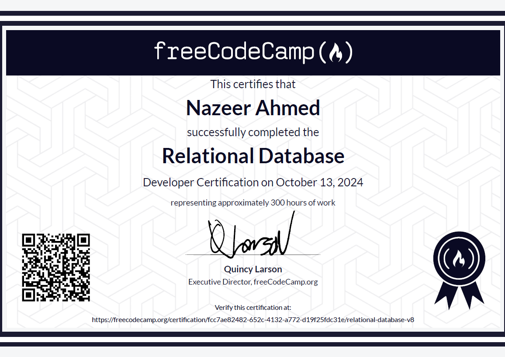

# Relational-Database-FCC
This repository contains the projects submitted for the Relational Database Certificate from FreeCodeCamp. Through these projects, I gained hands-on experience in designing and managing relational databases, writing efficient SQL queries using PostgreSQL, automating tasks with Bash scripting, and maintaining version control using Git. Each project showcases practical applications of these technologies and contributes to my development as a data engineer.

 

